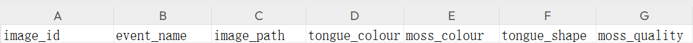

# 比赛框架使用说明
## 一、文件结构：
```
competition_frame/
      │
      └── classification/
               ├── data：分类数据集
               │     ├── data1: 赛题一（单任务学习——中草药识别挑战赛）数据集
               │     │     ├── images:中草药图片
               │     │     └── train.csv:存放有images相对路径及其labels
               │     └── data2: 赛题二（多任务学习——舌象分类挑战赛）数据集
               │           ├── images:舌象图片
               │           └── train.csv:存放有images相对路径、四个任务名（tongue_colour,moss_colour,tongue_shape,moss_quality）及其labels
               │
               ├── out：结果保存文件
               └── src：脚本文件
                     ├── dataset.py: 数据读取脚本
                     ├── model_utils.py: 模型配置脚本
                     ├── test.py: 测试脚本
                     └── train.py: 训练脚本
     
```
## 二、模型训练和测试权重文件
### 为了进行实现标准化统一测试，现统一规定模型最优权重文件命名为：xxx_best_state.pth，其保存和调用方式规定如下：
- 训练过程保存权重文件时，要求使用：
   ```
          torch.save(model.state_dict(), 'best_state.pth')
  ```
- 测试过程调用权重文件时，要求使用：
  ```
          best_state = torch.load(best_state_path)
          model.load_state_dict(best_state)
  ```
## 三、classification 分类接口
### 分类接口包含两部分：单任务和多任务分类，其中，单任务接口适用于中草药分类任务，多任务接口适用于舌象多任务学习
- ***dataset.py***：该部分为完整的数据读取文件，只允许调用，严禁修改
    - 该文件包含多任务舌象分类任务的数据读取类（MultitaskDataset）、单任务舌象分类的数据读取类（SingleTaskDataset）两部分内容。
        - 调用示例：以多任务学习为例 
          ```
          image_datasets = {'train': dataset.MultitaskDataset(train_path, sep, data_dir, data_transforms['train']),
                            'val': dataset.MultitaskDataset(val_path,  sep, data_dir, data_transforms['val'])}
          ```
          ```
          dataloaders_dict = {x: torch.utils.data.DataLoader(image_datasets[x], batch_size=batch_size, shuffle=True,
                                                           num_workers=2) for x in ['train', 'val']}
          ```

- ***CSV文件结构：***（以舌象多任务学习为例）
  - 注意：dataset文件从第D列开始是分类任务，每一列表示一项多分类任务，其数值对应的是labels
  



- ***train.py***：
  - 该文件已给出可调用的包，参赛者严禁增添或删减，只允许调用
  

- ***model_utils.py***:
  - 该文件已给出可调用的包，参赛者严禁增添或删减，只允许调用


- ***test.py***:
  - 该文件为完整的测试文件，适用于中草药分类和舌象多任务学习
  - 参赛者可修改的内容已在脚本中标出，未标识的严禁私自修改